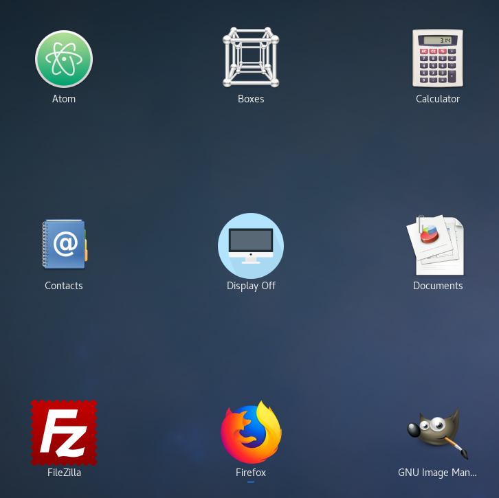

iMac Display Off
=====

This script adds an icon to turn off iMac display on Linux (iMac doesn't have a physical key to turn off display without sleeping)



Tested on iMac Mid 2011 Fedora 27

Installation
------------

```
git clone https://github.com/mpodshivalin/imac-display-off.git
cd imac-display-off
sh install.sh
```

Icon made by [Pixel perfect](https://www.flaticon.com/authors/pixel-perfect) from [www.flaticon.com](https://www.flaticon.com/) is licensed by [CC 3.0 BY](http://creativecommons.org/licenses/by/3.0/)
